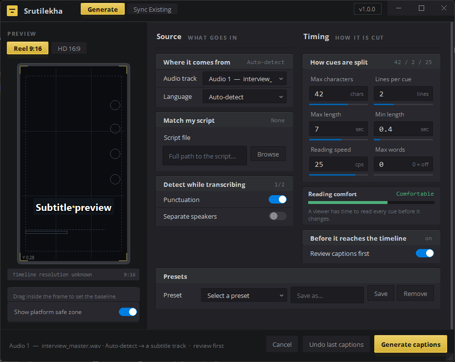

# Srutilekha

A DaVinci Resolve script that transcribes the audio on your timeline and puts
captions back on it as an SRT subtitle track. Built for Indic-language
footage: transcription is pinned to one script
(Devanagari, Bengali, Tamil, …) so code-switched English lands in that script
too, instead of breaking the line into two fonts.

Transcription is done by the [ElevenLabs Scribe](https://elevenlabs.io) API.
Everything else — cue splitting, timing, styling, placement — runs locally.



## What it does

- **Transcribe the timeline, not a file.** Reads the clips on the audio track
  you pick, transcribes the region each clip actually uses, and remaps the
  words back onto timeline positions — so cuts, gaps, and correction clips
  from a different file all land in the right place.
- **Single-script output.** Pinning a language forces Scribe to write that
  language's script, and a transliteration safety net catches Latin words that
  slip through (`fast food` → `फास्ट-फूड`). Auto-detect is available when you
  don't want the guarantee.
- **Cue splitting that reads well.** Every candidate boundary is scored on the
  punctuation before it (the danda ।/॥ and the Urdu ۔/؟ as well as the Latin
  marks), the width of the silence at it, and the grammar on both sides — so
  cues break where the phrase ends rather than where the character budget ran
  out. What counts as a pause is measured from the transcript itself, because a
  0.3s gap is a clear breath in rapid speech and ordinary word spacing in a slow
  delivery. No cue opens with a word that completes the phrase before it (है,
  ছিল, ஆகும், ఉంది, ಇದೆ, ഉണ്ട്, છે, ਹੈ, ଅଛି, ہے, and the postpositions and case
  markers written as separate words), and no word is carried into the next cue
  unless there is a boundary — or a budget — to justify it. Max characters,
  lines, duration, word count and a reading-speed (cps) budget are all
  respected.
- **Subtitle track of its own.** Cues are imported onto a new subtitle track
  with per-speaker colouring — existing subtitle tracks are never touched.
- **Free re-splitting.** The Scribe result is cached per (audio, model,
  language, diarize). Change the split settings and only the local cue-building
  re-runs — no second API call, no charge.
- **Only the trimmed part is uploaded.** Scribe bills by audio duration, so a
  trimmed clip sends just the region the timeline uses, not the whole source
  file. Windows are padded and merged, and cached per window, so nudging a trim
  by a few frames still costs nothing. Needs `ffmpeg` on PATH; without it the
  whole file is uploaded as before.
- **Review before it lands.** Optionally stop on a cue list you can read, edit,
  and re-split live before anything touches the timeline. A waveform over the
  list shows where the speaker actually paused, every row carries its own
  reading-speed bar, and cues that break the limits are striped red — so the
  ones that need work are findable without reading all of them. Selecting a cue
  drives the waveform window, the caption preview and an inspector showing its
  in/out, duration, characters and cps. The waveform needs `ffmpeg` on PATH;
  without it the rest of the screen works unchanged.
- **Undo.** Deletes the track the last run created — only ever the track it
  created itself.
- **Sync Existing.** Have an SRT whose text is right but whose timing is wrong?
  It re-aligns the existing text against the audio and leaves the words alone.
  If too little of the text can be found in the audio — wrong file, wrong
  language, wrong take — it says so instead of writing guessed timings.

## Requirements

- Windows (the Resolve-side script is cross-platform; setup and the UI are
  Windows-first)
- DaVinci Resolve
- Python 3.10+ with tkinter (3.10 is the floor for `truststore`; older works
  minus the corporate-proxy fix)
- An ElevenLabs API key

## Setup

```bash
setup.bat
```

It checks Python, installs `elevenlabs` and `truststore` with `--user`, records
the project path in `%USERPROFILE%\.audio_to_srt_path`, copies
`audio_to_srt.py` into Resolve's per-user Fusion `Scripts\Utility` folder as
`Srutilekha.py`, and prompts for your API key (saved to `.env`).

It also deletes any `Srutilekha.lua` left there by an earlier setup. Resolve
21.1 moved menu scripts onto built-in interpreters and runs the Lua one in a
sandbox with no `io` table, so the Lua half died on its first file read and the
menu entry did nothing at all — the error only visible in
`Support\logs\ResolveDebug.txt`. [audio_to_srt.py](audio_to_srt.py) is the port
that replaces it; [audio_to_srt.lua](audio_to_srt.lua) stays in the repo for
Resolve 21.0 and earlier.

No admin rights needed. On a network that inspects HTTPS, it falls back to
exporting the Windows certificate store to a PEM and handing that to pip.

Then, in Resolve: **Workspace → Scripts → Srutilekha**.

## Staying up to date

Setup is a one-time thing. After that the window updates itself: each time it
opens it asks GitHub, on a background thread, whether a newer release exists.

The right-hand end of the title bar always carries the answer, so there is no
state in which the updater is simply invisible:

| It shows | Meaning |
| --- | --- |
| `v1.0.0` | Up to date. Click it to check again right now. |
| `Checking…` | A check you asked for is in flight. The one at startup is silent — it can take a few seconds, and a chip that said this on every launch would read as stuck. |
| **Update** (blue) | A release is waiting. Click to see what changed and install it. |
| `Restart to finish` | Installed. Close the window and start the script again. |

Offline or rate-limited reads as "up to date" — the check fails silently
rather than putting an error in front of someone who opened the window to
make subtitles. Click the chip to retry.

Installing downloads the branch zip, checks it really is a Srutilekha release,
zips the version it is about to replace into `.update-backup\` (the last three
are kept), writes the new files, and re-deploys `audio_to_srt.py` into Resolve's
`Scripts\Utility` folder as `Srutilekha.py` — Resolve runs that copy, so
skipping it would leave the two halves at different versions. Nothing in the
install is touched until the download has been validated, so a failed or
truncated one leaves the working version exactly as it was. `.env`,
`subtitle_style.json`, `.cache/`, `presets/` and `logs/` are never replaced.
Close the window and start the script again to pick up the new version.

To publish a release, bump `version` in `version.json` and push to `main`. That
file is the single source of truth — `updater.VERSION` reads it, so there is no
second number to keep in step:

```json
{ "version": "1.1.0", "released": "2026-08-02", "notes": ["What changed."] }
```

Everyone sees it the next time they open the window (the raw-file CDN caches
for about five minutes). Add `"min_version": "1.1.0"` to make it required —
useful when a release changes the handshake file format between the Resolve-side
script and the loader, since an older half would otherwise break the run rather
than fail cleanly.

Pushing **without** bumping `version.json` still reaches everyone: the check
also compares the branch's head commit against the one each install recorded,
and offers the update with the commit subjects in place of release notes. So an
ordinary `git push` is enough to ship a fix; bumping the version is what earns
it a real version number and notes worth reading.

If the window will not open on some machine — the one case where an update is
both most needed and least reachable through the button — the same code runs
from a terminal in the project folder:

```bash
python updater.py --install
```

## Using it

Set your timeline in/out points if you only want part of it, then launch the
script. One window opens, with every setting on one page in two columns:

| Column | Controls |
| --- | --- |
| **Source** | audio track, language, reference script, punctuation, separate speakers |
| **Timing** | max characters, lines per cue, max/min length, reading speed, max words, review-first, save/load presets |

These were two tabs in earlier builds. Everything they held fits side by side
at this window width, and having half of it one click away meant the summary
in the action bar described settings you could not see.

A live preview beside the form shows where the cue lands and how big it is;
drag inside the frame to set the height. Once you hit Generate, the same window
becomes the progress view.

## Layout

| File | Role |
| --- | --- |
| [audio_to_srt.py](audio_to_srt.py) | Runs inside Resolve. Reads tracks and clip ranges, drives the UI and worker, imports and styles the SRT. Also owns Undo and Sync. Installed as `Srutilekha.py`. |
| [audio_to_srt.lua](audio_to_srt.lua) | The same thing in Lua, for Resolve 21.0 and earlier. Not installed by setup: 21.1's Lua sandbox has no `io`, so it cannot run there. |
| [loader.pyw](loader.pyw) | The single-window Tkinter UI — settings form, live preview, cue review/editor, progress. |
| [transcribe.py](transcribe.py) | The worker. Calls Scribe, normalizes and transliterates words, builds cues, writes the SRT and `.cap` sidecar. |
| [dialog.py](dialog.py) | Small dark-themed alert/pick/input dialogs the Lua script shells out to. |
| [updater.py](updater.py) | Version check and in-place install from the GitHub repo. Stdlib only. |
| `version.json` | The release the world is told about. Read over HTTPS by every installed copy. |
| [test_transcribe.py](test_transcribe.py) | Unit tests for the cue engine and cache. |
| [make_icon.py](make_icon.py) | Regenerates `icon.ico`. Run only when the glyph changes (needs Pillow). |
| `data/translit_*.json.gz` | Shipped English→Devanagari/Bengali spellings. Generated — see below. |
| [tools/build_translit.py](tools/build_translit.py) | Rebuilds those dictionaries. |
| [tools/translit_engine.py](tools/translit_engine.py) | Pronunciation→Indic engine. Build-time only. |
| [tools/translit_exceptions.py](tools/translit_exceptions.py) | Hand-verified spellings that override the engine. |

Generated at runtime, all gitignored: `.env` (your key), `.cache/` (transcript
cache), `logs/`, `presets/`, `.update-backup/` (zips of the versions the last
few updates replaced), `.update_state.json` (which commit this copy is on).

## Styling a subtitle track

Cue styling is not a form any more. The font is chosen per cue from the script
it is written in (see below), and point size, outline, drop shadow and colour
come from the defaults `audio_to_srt.py` ships in its `defaults` block — edit
that line to change them. Height in frame is the one placement a subtitle track
has, and it is set by dragging inside the preview.

Presets saved by an earlier build still load; the keys that described the
removed Text+ path are ignored.

### Reel and HD

The preview frame switches between **Reel** (9:16) and **HD** (16:9), and opens
on whichever shape the timeline actually is — Reel when Resolve reported no
resolution. This is not cosmetic: caption size is a share of frame *height* and
every position is frame-relative, so the same numbers mean different things in
the two frames. The plate under the preview says so when the frame you are
designing in is not the frame you are cutting for.

Subtitle height follows the frame, because the professional placement genuinely
differs:

| Frame | Height above the bottom | Why |
| --- | --- | --- |
| HD | `0.10` | The broadcast lower third — inside the title-safe margin, where subtitles are expected. |
| Reel | `0.28` | Instagram, TikTok and Shorts park their caption, handle and action buttons across the bottom of the frame. Subtitles at `0.10` sit underneath them. |

The loader converts that fraction to pixels against the timeline height and
sends it as `srt_posy`; `audio_to_srt.py` applies it to each subtitle item. Move
the slider and it is yours — switching frames no longer overrides it. If Resolve
reports no resolution, `srt_posy` is omitted entirely and the script's built-in
`posY` (620) stays in charge, exactly as before.

## Transliterating spoken English

With a language pinned, Scribe writes most spoken English in the target script
already — but it regularly leaves a token in Latin (`neurological`, `coffee`).
Left alone those stay Latin on screen and, being script-neutral, cannot be
given the right font either. So every Latin run is transliterated.

Every Indic language in the dropdown is covered. Devanagari (Hindi, Marathi,
Nepali, Sanskrit) and Bengali (Bengali, Assamese) each ship a dictionary and a
phonetic table of their own. Gurmukhi, Gujarati, Odia, Tamil, Telugu, Kannada
and Malayalam borrow Devanagari's: the Indic blocks are laid out in parallel,
so a word resolved in Devanagari becomes the same word in any of them by adding
a fixed offset to every codepoint. That is why they need no dictionary — they
get the same CMU-derived spellings Hindi does, rather than the rougher output a
separate letter-based engine would give them.

The offset alone is not the whole job, and the corrections are in
`languages/scripts.py`. Tamil has one stop per place of articulation, so the
voiced and aspirated series fold onto the plain one (`bread` → `ப்ரேட்`).
Devanagari's candra-O — the "aw" of `doctor`, `call` — has no counterpart in
most of these scripts, and they do not agree on what to write instead: `ā` in
Punjabi, Tamil, Telugu and Kannada, long `ō` in Malayalam, and nothing at all in
Odia, whose inherent vowel already is that sound (`ଡକ୍ଟର`). Devanagari deletes a
word-final schwa and the Dravidian scripts and Odia do not, so they need the
vowel-killer put back or `ब्रेड` would read *brēḍa* — this affects 72% of the
dictionary. Punjabi writes clusters with no visible halant (`ਸਕੂਲ`, `ਡਾਕਟਰ`).

**Urdu is the exception.** Perso-Arabic shares no layout with the Indic blocks,
so it cannot be reached this way and would need tables of its own. A leaked
Latin token in an Urdu transcript is still left as it is.

Doing that letter by letter does not work, because English spelling does not
predict English pronunciation: `neurological` comes out `नेउरोलोगिकाल`.
The spellings are therefore derived from *pronunciations* — the CMU
Pronouncing Dictionary — which gets to `न्यूरोलॉजिकल`. Hindi convention also
consults the spelling for reduced vowels (`फेस्टिवल`, `मार्केट`), so the engine
uses both.

That reaches the conventional spelling for about four words in five. The rest
are irregular enough that no rule finds them, and they are listed by hand in
`tools/translit_exceptions.py`, which wins over the engine. Words in neither —
names, invented words — fall back to the letter-based rules in `transcribe.py`,
which are rough but always land in the target script. The borrowed-script
languages inherit that fallback too: the rules run in Devanagari and the result
is offset across, so a dictionary miss still never leaves a word in Latin.

**To fix a spelling**, add the word to `tools/translit_exceptions.py`, then:

```bash
python tools/build_translit.py
```

Commit the regenerated `data/` files; never edit the `.json.gz` directly. The
build downloads CMUdict on first run (3.6 MB, gitignored — it is a build input,
and shipping it would put it in every user's update download). The build is
deterministic: unchanged input produces byte-identical output and no diff.

Nothing here runs at transcription time. There is no API call, no key and no
third-party package in the transliteration path — just a data file, loaded
lazily the first time a Latin word actually appears.

## Tests

```bash
python test_transcribe.py
```

86 tests, no API key or Resolve needed — they cover wrapping, cue-splitting
rules, SRT serialization, the cache round-trip, the re-split path, the golden
transliteration spellings, and one regression test per bug that has reached a
user. The segmentation ones run a
sample sentence in each of thirteen languages through three speaking rates and
seven budget combinations, checking that the cues are a faithful partition of the
word stream, that none opens with a phrase-completing word, that no word is
carried over without a boundary to justify it, and that every budget holds.
Two of them read the language dropdown out of `loader.pyw` and check it against
the engine's tables in both directions, because a language wired through the
whole engine and left off the form is unreachable — which is how Assamese and
then Odia were lost.
`pytest` works too if you have it:

```bash
python -m pytest test_transcribe.py -q
```

## Notes

- **Editing `audio_to_srt.py` requires a redeploy.** Resolve runs the *copy* in
  its Scripts folder (`Srutilekha.py`), not the file in this repo. Re-run
  `setup.bat` (or re-copy it) after every change to that one file. The other
  Python files are read live.
- **Overriding the language** outside the UI: set `ELEVENLABS_LANGUAGE` to an
  ISO 639-1/639-3 code (or `auto`).
- **`transcribe.py` standalone:**
  ```bash
  python transcribe.py <audio> <out.srt> [max_chars] [max_lines] [max_secs]
  ```
- **Logs** land in `logs/audio_to_srt.log` — the first place to look when a run
  fails silently inside Resolve.
